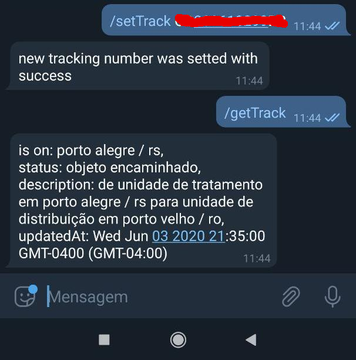
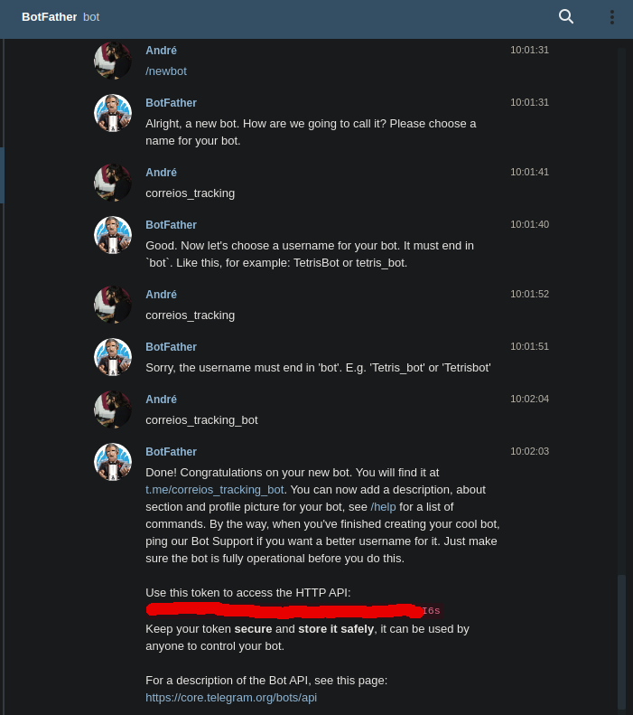

# Correios Tracking

### result



### how to use

first clone the project

```
git clone https://github.com/oliveira-andre/correios_tracking.git
cd correios_tracking
```

create a telegram token bot



create a dotenv file and configure the telegram_token environment

```
touch .env
echo "telegram_token='<your telegra token api>' >> .env"
```

run server with docker

```
sudo docker-compose up --build -d
```
