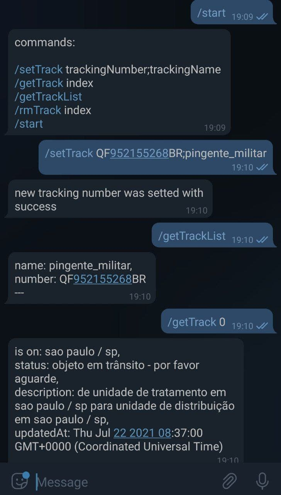

# Correios Tracking

### result



### how to use

first clone the project

```
git clone https://github.com/oliveira-andre/correios_tracking.git
cd correios_tracking
```

install dependencies

```
yarn add node -g
yarn install
```

create a telegram token bot


create a dotenv file and configure the telegram_token environment

```
touch .env
echo "telegram_token='<your telegra token api>' >> .env"
```

run server

```
yarn node app.js
```

or

```
node app.js
```
